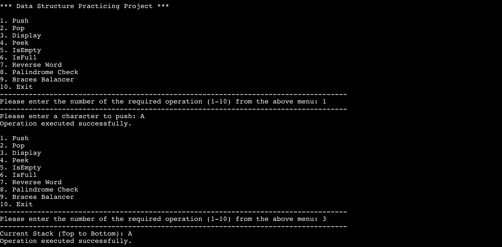
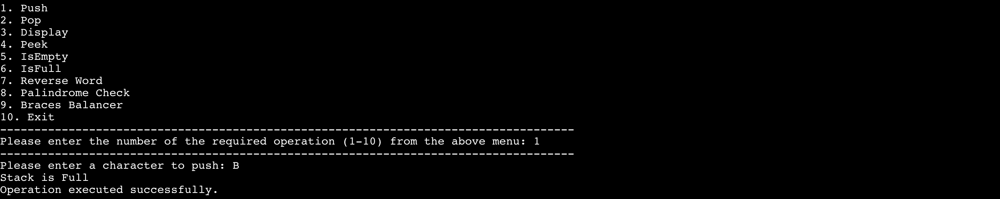
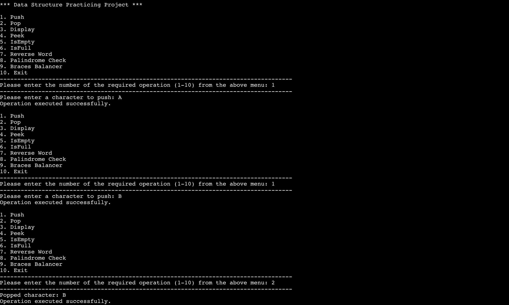
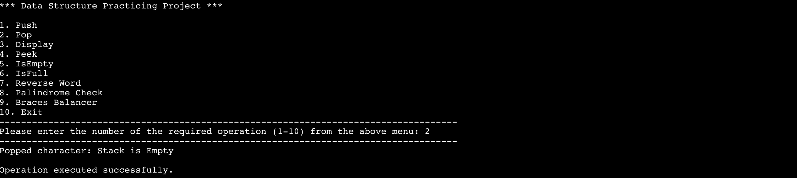
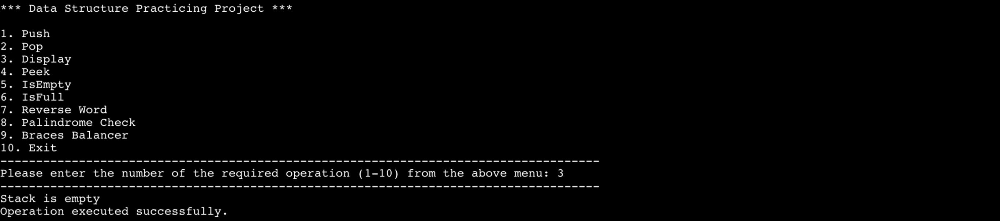
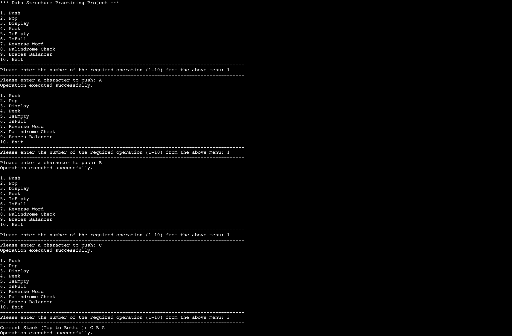
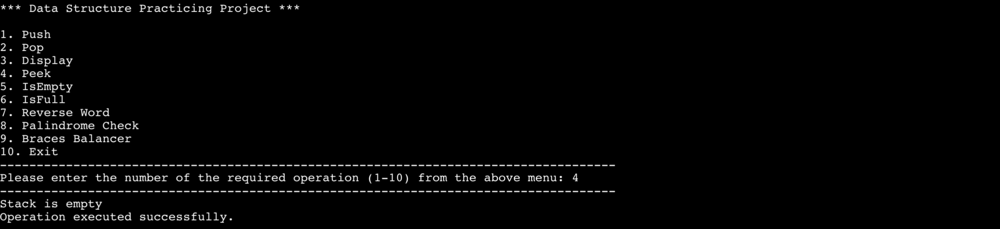
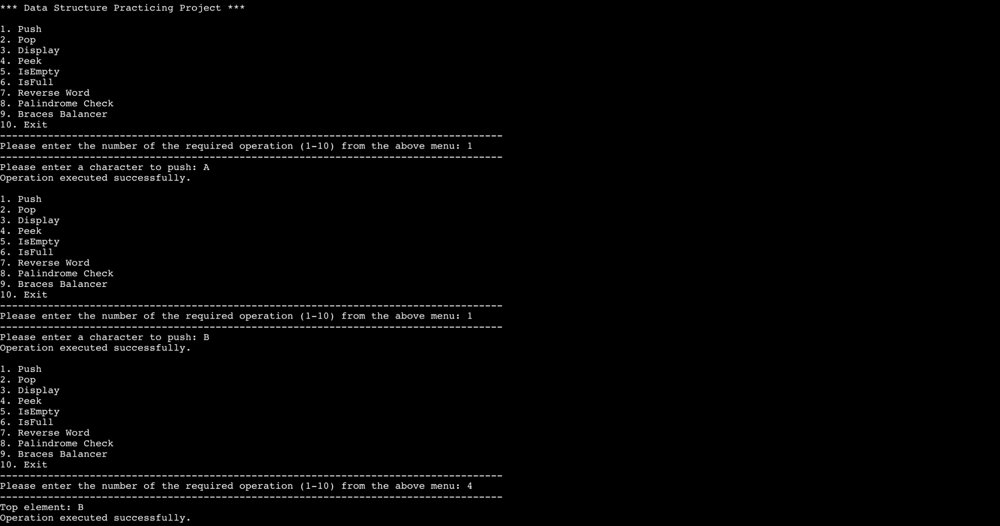
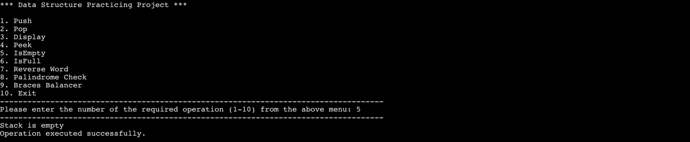
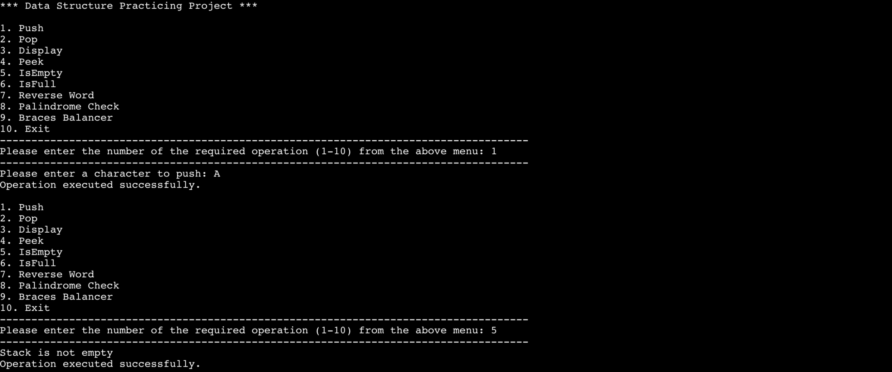

<div align="center">

# Array-Based-Stack-Data-Structures

</div>

> **Disclaimer:** This project has been prepared for academic and personal purposes only, and represents the sole individual work of the author named above. No part of this project may be copied, reproduced, quoted, distributed, or used in any form — in whole or in part — without prior written permission from the author.

# Table of Contents

- [Abstract](#abstract)
- [Introduction](#introduction)
- [Problem Statement](#problem-statement)
- [Project Objectives](#project-objectives)
- [Scope of the Project](#scope-of-the-project)
- [Literature Review](#literature-review)
- [Chosen Data Structure](#chosen-data-structure)
- [Operations](#operations)
- [Implementation](#implementation)
- [Conclusion](#conclusion)
- [References](#references)
- [Contact](#contact)

# Abstract
This project presents the design and implementation of an Array-Based Stack in C++. The stack follows the Last-In-First-Out (LIFO) principle, where the most recently added element is the first one to be removed. The implementation includes basic operations such as push, pop, display, peek, isEmpty, and isFull, in addition to three applied operations: reverseWord, isPalindrome, and isBalanced. The project demonstrates the simplicity and efficiency of using a fixed-size array to manage a limited set of elements when the maximum size is known in advance. Practical examples such as reversing strings, checking palindromes, and balancing braces highlight the stack’s usefulness in solving real-world problems. 

# Introduction

Stacks are a fundamental data structure in computer science, used extensively for storing and managing data in a Last-In-First-Out (LIFO) manner. They are vital in applications such as expression evaluation, backtracking algorithms, and memory management. This project focuses on implementing an array-based stack, demonstrating its essential operations like push, pop, and display, alongside three additional related operations: reversing a word, checking for palindromes, and balancing braces. The implementation provides a menu-driven interface that allows the user to interact with the stack and observe its behavior. 

# Problem Statement
The problem addressed in this project is the need for a simple and efficient way to store and manage a limited number of elements using the LIFO principle. When using a fixed-size array, the implementation must handle overflow and underflow conditions properly and provide essential operations such as insertion, deletion, and inspection. Furthermore, practical tasks like reversing a string, verifying whether a string is a palindrome, and checking whether braces in an expression are balanced can be solved naturally using a stack. Without a stack, these tasks may require more complex logic and additional memory management. Therefore, this project aims to provide a clear implementation of an array-based stack and demonstrate its use in both basic and applied operations. 

# Project Objectives

.1 To design and implement an Array-Based Stack in C++.
.2 To implement the basic stack operations: push, pop, display, peek, isEmpty, and isFull.
.3 To add three applied operations: reverseWord, isPalindrome, and isBalanced.
.4 To build a menu-driven interface that allows the user to select and execute operations.
.5 To test different cases, including empty stack, full stack, and invalid operations.
6 To demonstrate the role of stacks in solving practical problems within a data structures course project.

1.	To design and implement an Array-Based Stack in C++..
2.	To implement the basic stack operations: push, pop, display, peek, isEmpty, and isFull.
3.	To add three applied operations: reverseWord, isPalindrome, and isBalanced.
4.	To build a menu-driven interface that allows the user to select and execute operations.
5.	To test different cases, including empty stack, full stack, and invalid operations.
6.	To demonstrate the role of stacks in solving practical problems within a data structures course project.

# Scope of the Project
The scope of this project is limited to the implementation of a fixed-size array-based stack in C++. It does not include dynamic stack implementation or linked-list-based stacks. The project covers the basic operations and the three additional operations mentioned above, with a simple text-based menu interface for input and output. There is no graphical user interface or persistent data storage. The implementation is suitable for situations where the maximum number of elements is known beforehand and memory constraints are manageable.

# Literature Review
Stacks are among the oldest and most widely used data structures in computer science. They are applied in many areas, including expression evaluation, number system conversion, depth-first search (DFS), and undo mechanisms in software applications. The array-based implementation is known for its simplicity and memory efficiency when the maximum capacity is known in advance, although it is limited by its fixed size. In contrast, a linked-list implementation offers greater flexibility but with increased complexity. This project relies on fundamental concepts from sources such as GeeksforGeeks, Simplilearn, Stack Overflow, and TutorialsPoint. These references provide standard definitions, implementation techniques, and practical examples of stack usage. The project applies these concepts by implementing a complete array-based stack and using it to solve string and expression-based problems.

# Chosen Data Structure
An array-based stack utilizes a fixed-size array to store elements, where each element is added to the top of the stack. This structure is chosen for its simplicity and efficiency in managing a defined, limited set of elements. The stack is implemented with an array stack and a top pointer to track the stack's current status. Array-based stacks are optimal when the maximum number of elements is known beforehand and memory constraints are manageable.

# Operations
This implementation includes both fundamental stack operations and additional features to enhance functionality.

### Basic Operations

- **Push:** Adds an element to the top of the stack if space is available. It checks for stack overflow and, if space permits, adds the element at `stk[top]` and increments `top`.

```cpp
// Push Function
void push(char c) {
    if (isFull()) {
        cout << "Stack Overflow! Cannot push " << c << endl;
        return;
    }
    stk[++top] = c;
}
```

- **Pop:** Removes and returns the topmost element if the stack is not empty. It checks for underflow and, if the stack contains elements, retrieves the top element and decrements `top`.

```cpp
// Pop Function
char pop() {
    if (isEmpty()) {
        cout << "Stack Underflow! Cannot pop from an empty stack." << endl;
        return '\0'; // Return null character as an error indicator
    }
    return stk[top--];
}
```

- **Display:** Shows all elements in the stack, starting from the top, and provides a visual of the stack's contents.

```cpp
// Display Function
void display() {
    if (isEmpty()) {
        cout << "Stack is empty. Nothing to display." << endl;
        return;
    }
    cout << "Stack elements (top to bottom): ";
    for (int i = top; i >= 0; i--) {
        cout << stk[i] << " ";
    }
    cout << endl;
}
```

- **Peek:** Retrieves the top element without removing it, allowing users to inspect the most recently added item.

```cpp
// Peek Function
void peek() {
    if (isEmpty()) {
        cout << "Stack is empty. Nothing to peek." << endl;
        return;
    }
    cout << "Top element: " << stk[top] << endl;
}
```

- **IsEmpty:** Checks whether the stack is empty, which is crucial for validating operations that depend on the stack's state.

```cpp
// IsEmpty Function
bool isEmpty() {
    return (top == -1);
}
```

- **IsFull:** Determines if the stack has reached its maximum capacity, helping to avoid overflow errors.

```cpp
// IsFull Function
bool isFull() {
    return (top == MAX - 1);
}
```

### Additional Operations

- **Reverse Word:** Utilizes the stack to reverse a given string by pushing each character onto the stack and then popping them to form the reversed string.

```cpp
// Reverse Word Function
string reverseWord(string str) {
    string reversedWord;
    s.top = -1;

    for (int i = 0; i < str.length(); i++) {
        push(str[i]);
    }

    while (!isEmpty()) {
        reversedWord += pop();
    }

    return reversedWord;
}
```

- **Palindrome Checker:** Utilizes the stack to verify if a given string reads the same backward as forward.

```cpp
// Palindrome Checker Function
bool isPalindrome(string str) {
    s.top = -1;

    for (int i = 0; i < str.length(); i++) {
        push(str[i]);
    }

    for (int i = 0; i < str.length(); i++) {
        if (str[i] != pop()) {
            return false;
        }
    }

    return true;
}
```

- **Braces Balancer:** Ensures that all opening braces in an expression are properly closed and nested.

```cpp
// Braces Balancer Function
bool isBalanced(string expr) {
    s.top = -1;

    for (int i = 0; i < expr.length(); i++) {
        char c = expr[i];

        if (c == '(' || c == '[' || c == '{') {
            push(c);
        } else if (c == ')' || c == ']' || c == '}') {
            if (isEmpty()) {
                return false;
            }

            char topChar = pop();

            // Check for matching pairs
            if ((c == ')' && topChar != '(') ||
                (c == ']' && topChar != '[') ||
                (c == '}' && topChar != '{')) {
                return false;
            }
        }
    }

    return isEmpty();
}
```
# Implementation
### Push and Display
Below is an of how the program works when pushing a character onto the stack and then displaying the current stack contents.



### Push Operation when Stack is Full (Overflow)
This demonstrates what happens when the user tries to push an element onto a stack that has already reached its maximum capacity (`MAX = 100`).



### Push and Pop Operations (LIFO Demonstration)
This demonstrates the Last-In-First-Out (LIFO) nature of the stack. It shows the sequence of pushing two elements onto the stack and then popping the most recently added element.



### Pop Operation when Stack is Empty (Underflow)
This demonstrates how the program handles an underflow condition. It shows what happens when the user tries to pop an element from a stack that has no elements.



### Display Operation when Stack is Empty
This demonstrates the behavior of the program when the user attempts to display the contents of an empty stack.



### Multiple Push Operations and Display Order
This demonstrates how elements are stored in the stack following the Last-In-First-Out (LIFO) principle, and how the `display()` function outputs the elements from the top-most to the bottom-most.



### Peek Operation on an Empty Stack
This demonstrates the behavior of the `peek()` function when the user tries to look at the top element of an empty stack.



### Peek Operation with a Non-Empty Stack
This demonstrates the `peek()` operation, which allows the user to view the top element of the stack without removing it. It also shows how to push multiple elements to build up the stack.



### IsEmpty Operation on an Empty Stack
This demonstrates the `IsEmpty` operation, which checks whether the stack currently contains any elements.



### IsEmpty Operation on a Non-Empty Stack
This demonstrates the `IsEmpty` operation after pushing an element. It shows how the stack's state changes from empty to non-empty.



# Conclusion
This project successfully demonstrates the design and implementation of an Array-Based Stack in C++. The stack operates on the fundamental Last-In-First-Out (LIFO) principle and includes all essential operations: push, pop, display, peek, isEmpty, and isFull. These operations provide a reliable and efficient way to manage a limited set of elements when the maximum size is known in advance. The implementation also handles critical cases such as stack overflow and underflow, ensuring robustness and correctness.

# References
1. [GeeksforGeeks – Stack Data Structure](https://www.geeksforgeeks.org/dsa/stack-data-structure/)
2. [Simplilearn – Stack Implementation Using Array](https://www.simplilearn.com/tutorials/data-structure-tutorial/stack-implementation-using-array)
3. [GeeksforGeeks – Reverse Words in a Given String](https://www.geeksforgeeks.org/)
4. [Stack Overflow – Testing if a User Entered String is a Palindrome Using Stacks](https://stackoverflow.com/)
5. [GeeksforGeeks – Valid Parentheses in an Expression](https://www.geeksforgeeks.org/dsa/check-for-balanced-parentheses-in-an-expression/)

# Contact

For questions, feedback, or support:

**Mohammed Abdulrahman Alalyani**
- Email: [malredfan@gmail.com](mailto:malredfan@gmail.com)
- Instagram: [@malredfan](https://instagram.com/malredfan)
- X: [@malredfan](https://x.com/malredfan)
- LinkedIn: [malredfan](https://linkedin.com/in/malredfan)
